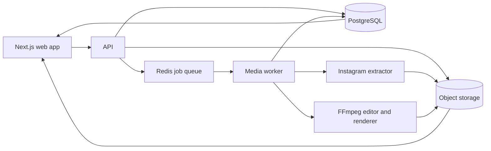

# Editing Site

A planned web application for downloading permitted public Instagram videos, keeping them temporarily in a media library, editing them with a focused set of tools, and saving Instagram-ready exports in a separate section.

> **Current status:** architecture and delivery plan only. Application development has not started yet.

## Product goal

The first complete user journey will be:

1. Paste a permitted public Instagram Reel or video-post link.
2. Extract the highest available source, thumbnail, username, and post caption.
3. Save the video and caption temporarily in **Media**.
4. Upload other local videos to the same Media section when needed.
5. Open a video in a non-destructive editor.
6. Crop, add text, choose a font/color, create a mixed-color background, split the timeline, and remove unwanted sections.
7. Render an Instagram-compatible MP4.
8. Save the result in a separate **Edited Videos** section.

Private posts, Stories, login bypasses, DRM bypasses, and bulk account downloads are outside the planned scope.

## System overview



### Proposed stack

| Layer | Proposed technology | Responsibility |
| --- | --- | --- |
| Web application | Next.js + TypeScript | Downloader, Media, Editor, and Edited Videos screens |
| API | Node.js + Fastify | Validation, signed URLs, projects, jobs, and access control |
| Download worker | Python + `yt-dlp` | Public Instagram extraction and metadata |
| Render worker | FFmpeg | Crop, overlays, split/concat, backgrounds, and Instagram-ready export |
| Job queue | Redis + BullMQ | Long-running downloads and renders outside web requests |
| Database | PostgreSQL | Metadata, captions, projects, edit instructions, and job state |
| File storage | S3-compatible storage such as Cloudflare R2 | Source videos, uploads, thumbnails, and exports |

The web request will never stay open for a full video download or render. The API creates a background job and the browser reads its progress using a job ID.

## Functional areas

### 1. Instagram downloader

- Accept only exact `https://www.instagram.com/reel/...`, `/p/...`, and `/tv/...` URLs.
- Normalize the URL and reject arbitrary hosts before a worker sees it.
- Extract only publicly available media without asking for Instagram passwords or cookies.
- Store title, post caption, creator username, thumbnail, duration, dimensions, and source link.
- Download the highest available video/audio streams and merge them with FFmpeg.
- Automatically create a Media record after completion.
- Use clear states: queued, inspecting, downloading, processing, ready, expired, and failed.

Instagram extraction can fail when Instagram changes internal responses or rate-limits server IPs. The extractor therefore stays isolated in its own worker and can be updated or replaced without changing the editor.

### 2. Media library

The **Media** section will contain:

- completed Instagram downloads;
- videos uploaded from the user's device;
- thumbnail, duration, resolution, size, source type, and expiry;
- the original Instagram caption in an editable field;
- actions to preview, edit, download, or delete an asset.

Working default: downloaded source files remain for **7 days**, configured through `SOURCE_RETENTION_DAYS`. Opening an unfinished edit project refreshes source retention so an active project does not break unexpectedly.

### 3. Focused video editor

Editing is non-destructive. The source video is never modified; the browser saves a small versioned JSON edit specification.

#### Crop

- Presets: `9:16`, `1:1`, `4:5`, and `16:9`.
- Optional custom crop box.
- Browser preview stores normalized `x`, `y`, `width`, and `height` values.
- Render worker converts them into FFmpeg `crop` and `scale` filters.

#### Text overlays

- First version is limited to **4 bundled fonts**.
- First version is limited to **5 approved text colors**.
- Controls: text, font, color, size, alignment, position, start time, and end time.
- Font files are bundled in both the web app and render worker so preview and export match.
- Exact font names and five color values will be finalized before editor implementation.

#### Mixed-color background

- User enters two or three HTML hex colors such as `#FF3E81` and `#7A5CFF`.
- Every value is validated as a six-digit hex color.
- Controls include color stops and gradient angle.
- Browser shows a live CSS/canvas preview.
- Worker creates the same gradient and composites the cropped video above it.

#### Split and remove

- Clicking **Split** adds a boundary at the playhead.
- Timeline becomes a list of `{ startMs, endMs, enabled }` segments.
- **Delete** disables a selected segment without changing the source file.
- Export renders only enabled segments and concatenates them in order.
- Undo/redo uses edit-spec history in the browser.

Example edit specification:

```json
{
  "version": 1,
  "canvas": {
    "aspectRatio": "9:16",
    "background": {
      "type": "gradient",
      "colors": ["#FF3E81", "#7A5CFF"],
      "angle": 135
    }
  },
  "crop": { "x": 0.08, "y": 0, "width": 0.84, "height": 1 },
  "segments": [
    { "startMs": 0, "endMs": 8200, "enabled": true },
    { "startMs": 8200, "endMs": 11600, "enabled": false },
    { "startMs": 11600, "endMs": 24000, "enabled": true }
  ],
  "textOverlays": [
    {
      "text": "Sample text",
      "fontId": "font-1",
      "colorId": "color-1",
      "x": 0.5,
      "y": 0.12,
      "size": 48,
      "startMs": 500,
      "endMs": 5000
    }
  ]
}
```

### 4. Edited Videos

- Every successful render creates a new immutable export record.
- Source video and edit project remain separate.
- Show thumbnail, export date, duration, resolution, size, and originating project.
- Actions: preview, download, duplicate edit, rename, or delete.
- Edited exports remain until the user deletes them or a future account/storage policy is introduced.

## Instagram export profile

The main target is a video that can be uploaded as an Instagram Reel or video post. The initial safe preset will use:

- MP4 container;
- H.264/AVC video;
- AAC audio at 48 kHz;
- `yuv420p` pixel format and even dimensions;
- 30 fps by default;
- `9:16` and `1080 × 1920` as the default Reel canvas;
- video bitrate below Instagram's documented maximum;
- MP4 `faststart` metadata for reliable upload/preview.

Meta's current Reels publishing documentation allows MOV or MP4, H.264 or HEVC video, AAC audio, 23–60 fps, up to 1920 horizontal pixels, and recommends a 9:16 aspect ratio. It currently documents a 25 Mbps maximum video bitrate, 128 kbps audio bitrate, 3-second minimum, 15-minute maximum, and 1 GB maximum file size. These limits must be kept in configuration and rechecked before production releases because platform rules can change.

Source: [Meta Instagram API documentation](https://www.postman.com/meta/instagram/documentation/6yqw8pt/instagram-api)

## Planned data model

| Entity | Important fields |
| --- | --- |
| `users` | `id`, identity-provider ID, timestamps |
| `media_assets` | owner, source type, object key, thumbnail key, caption, duration, dimensions, size, status, `expires_at` |
| `edit_projects` | owner, source asset, name, `edit_spec` JSONB, version, timestamps |
| `render_jobs` | project, status, progress, error code, attempts, worker timestamps |
| `exports` | owner, project, object key, thumbnail key, duration, dimensions, size, created time |

Object keys are generated by the server:

```text
users/{userId}/sources/{assetId}/source.mp4
users/{userId}/sources/{assetId}/thumbnail.jpg
users/{userId}/exports/{exportId}/video.mp4
users/{userId}/exports/{exportId}/thumbnail.jpg
```

Clients receive short-lived signed URLs and never receive storage credentials.

## Planned API surface

| Method | Route | Purpose |
| --- | --- | --- |
| `POST` | `/api/downloads/inspect` | Validate link and return available metadata |
| `POST` | `/api/downloads` | Create a permitted Instagram download job |
| `GET` | `/api/jobs/:jobId` | Read download/render progress |
| `GET` | `/api/media` | List active Media assets |
| `POST` | `/api/media/uploads` | Create an upload and return a signed upload URL |
| `PATCH` | `/api/media/:assetId` | Update caption or display name |
| `DELETE` | `/api/media/:assetId` | Delete an owned source asset |
| `POST` | `/api/projects` | Create an edit project from a Media asset |
| `PATCH` | `/api/projects/:projectId` | Save the validated edit specification |
| `POST` | `/api/projects/:projectId/renders` | Queue an Instagram-ready export |
| `GET` | `/api/exports` | List Edited Videos |
| `DELETE` | `/api/exports/:exportId` | Delete an owned export |

Every asset/project lookup includes the authenticated owner ID; knowing another record's UUID must never grant access.

## Reliability and safety

- Require an ownership/permission confirmation before an Instagram download.
- Add per-user and per-IP rate limits.
- Use random job and object IDs; never use user input as a filesystem path.
- Enforce duration, file-size, resolution, bitrate, and render-time limits.
- Run `yt-dlp` and FFmpeg with argument arrays, not shell-interpolated commands.
- Isolate workers from the public API and restrict outbound hosts.
- Use signed object URLs, encrypt secrets, and redact extractor logs.
- Automatically remove expired sources and failed partial uploads.
- Make cleanup idempotent so database and storage retries are safe.
- Maintain a report/takedown path and download only content the user owns or has permission to use.

## Branch strategy

| Branch | Purpose |
| --- | --- |
| `main` | Stable planning and production-ready releases |
| `develop` | Integration branch for completed feature work |
| `feature/instagram-downloader` | Link inspection, download jobs, caption extraction, and source normalization |
| `feature/media-library` | Uploads, temporary storage, caption editing, and Media UI |
| `feature/video-editor` | Crop, text, colors, gradient background, timeline split/delete, and edit JSON |
| `feature/export-library` | Render queue, Instagram-compatible exports, and Edited Videos UI |
| `infra/platform` | Database, Redis, object storage, authentication, deployment, and observability |

Feature branches start from `develop`. Small pull requests merge into `develop`; tested release candidates merge from `develop` into `main`.

## Delivery roadmap

### Phase 1 — platform foundation

- Next.js application shell and authentication.
- PostgreSQL schema and ownership rules.
- Object-storage uploads and signed downloads.
- Redis queue and worker health reporting.

### Phase 2 — downloader and Media

- Public Instagram link inspection.
- Background download and progress.
- Caption/thumbnail storage.
- Media screen, uploads, retention, and cleanup.

### Phase 3 — editor

- Video preview and timeline.
- Crop presets and custom crop.
- Four-font and five-color text system.
- HTML hex gradient backgrounds.
- Split, remove, undo, redo, and autosave.

### Phase 4 — render and Edited Videos

- Validate edit JSON on the API and worker.
- Generate FFmpeg filter graphs.
- Instagram-compatible export preset.
- Render progress, retries, and cancellation.
- Edited Videos library and download flow.

### Phase 5 — production hardening

- Abuse limits, storage quotas, monitoring, and alerts.
- Instagram upload compatibility checks.
- Failure recovery, cleanup audits, and end-to-end tests.

## Decisions to finalize before implementation

- Authentication method: email/password, Google, or another provider.
- Exact source retention period; current working default is 7 days.
- Names/files for the four bundled fonts.
- Exact five approved text colors.
- Cloud provider for PostgreSQL, Redis, object storage, web app, and workers.
- Free-plan duration/storage limits and whether paid plans are needed.
